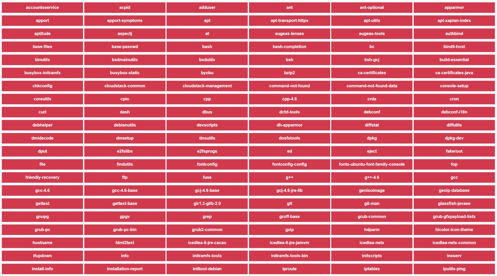
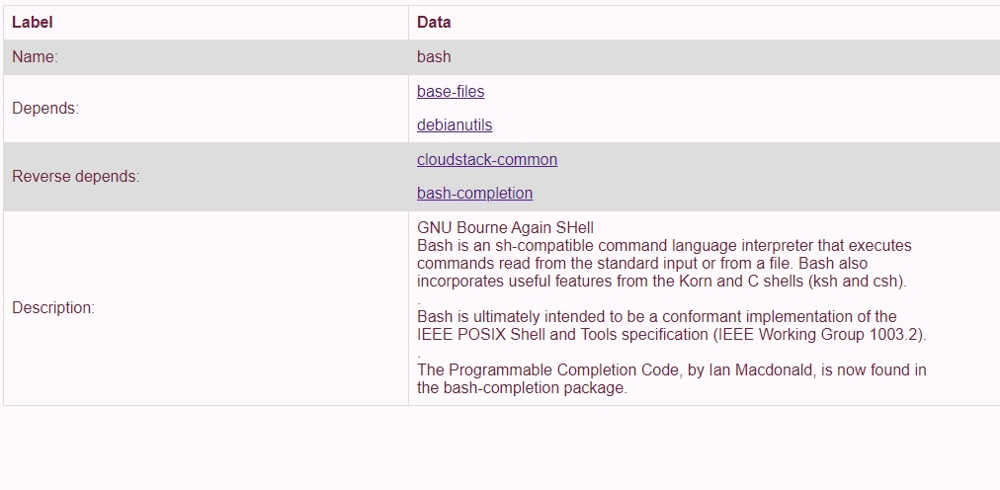

# statusFileReader

On a Debian and Ubuntu systems, there is a file called /var/lib/dpkg/status that holds information about software packages that the system knows about. This program exposes some key information about packages in the file via an HTML interface.

# Instructions

    - clone the repository

    - $ npm install
    
    - $ node App.js

    - in your browser go to: http://localhost:3000

If you have a Debian / Ubuntu system, you can upload your own file. If not, you can use the example data.

# Screenshot 1:

# Screenshot 2:

# Screenshot 3:

